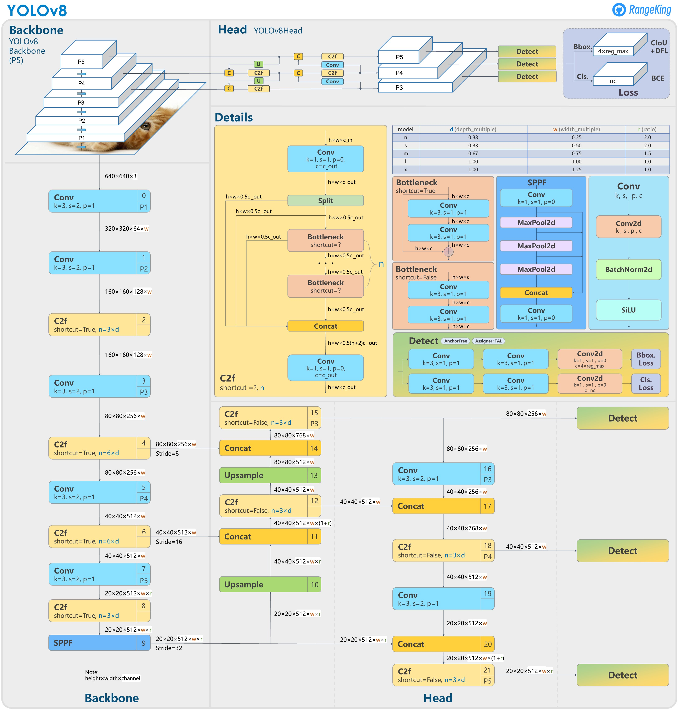
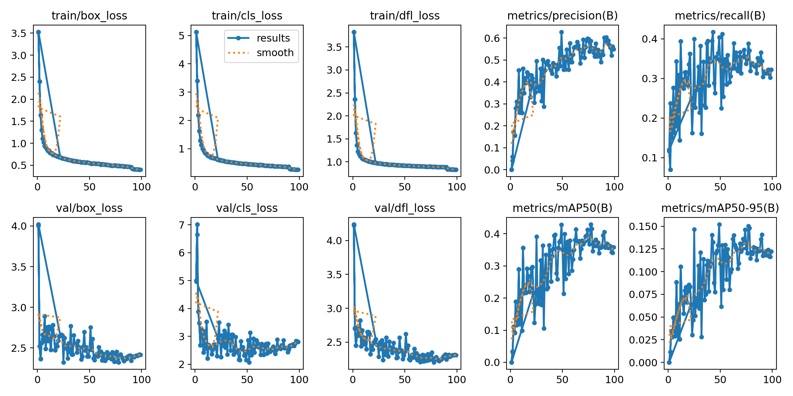
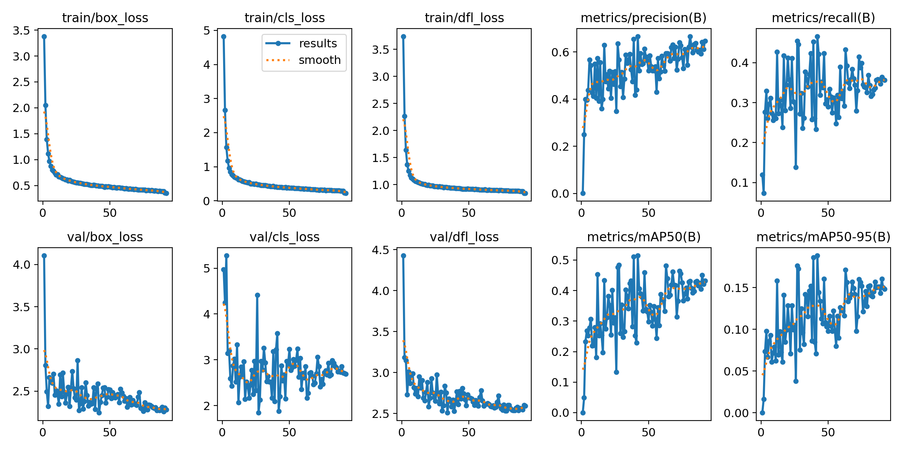
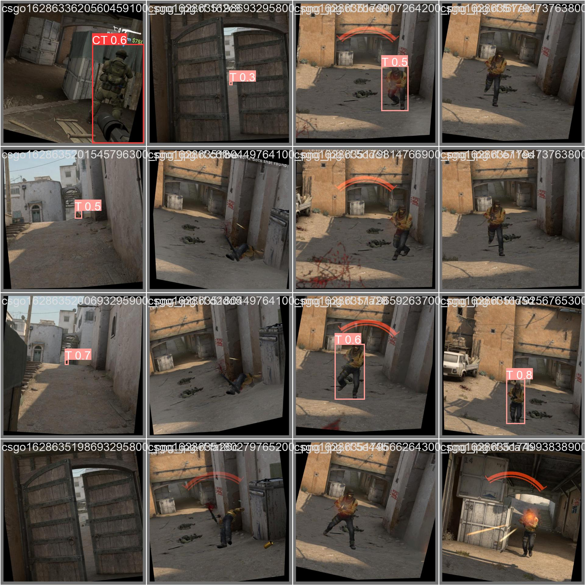
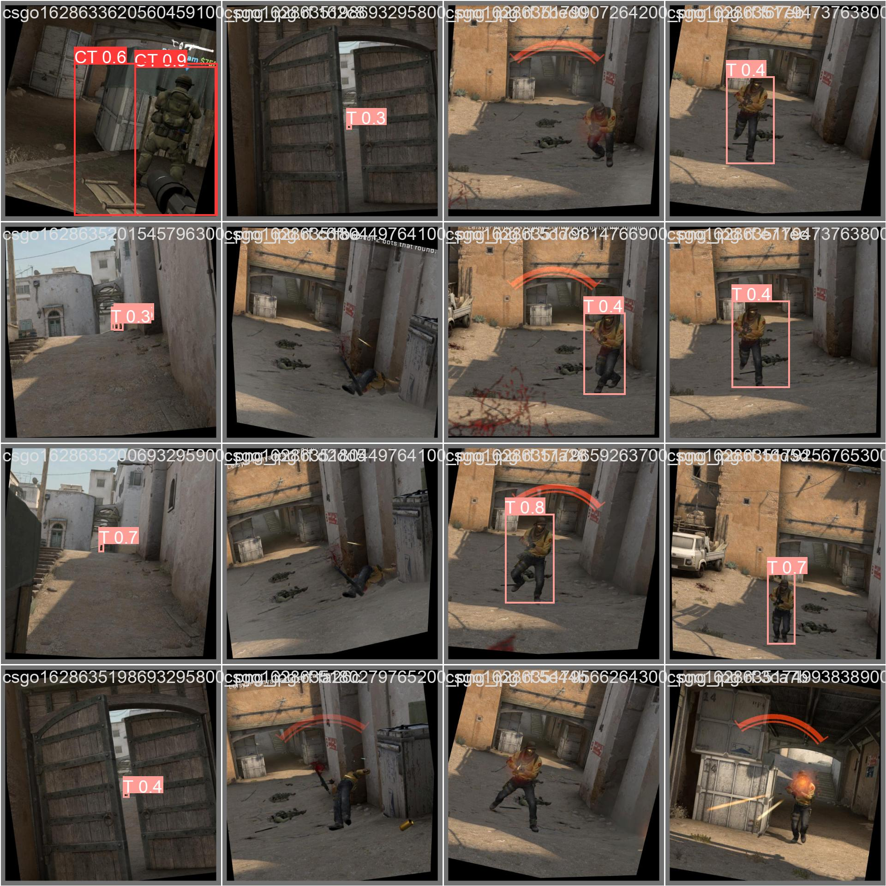

## Домашнее задание №1
ФИО: Ярмухаметов Юрий Алексеевич

Предмет: Обработка и генерация изображений

Задача: Детекция объектов

Датасет: [CSGO AIMBOT](https://universe.roboflow.com/new-workspace-rp0z0/csgo-train-yolo-v5)

модель: Yolo v8

### Описание задачи

Предположим, что необходимо получить модель для детекции объектов, а ресурсы сильно ограничены  и требуется крайне быстрая модель. Подобная проблема может возникнуть при использовании модели на устройствах jetson, rpi. Yolo v8 "из коробки" предлагется в нескольких вариантах, которые отличаются по своей производительности и архитектуре, хотя и сделаны по одному шаблону:

  n: [0.33, 0.25, 1024]  # YOLOv8n summary: 225 layers,  3157200 parameters,  3157184 gradients,   8.9 GFLOPs
  
  s: [0.33, 0.50, 1024]  # YOLOv8s summary: 225 layers, 11166560 parameters, 11166544 gradients,  28.8 GFLOPs
  
  m: [0.67, 0.75, 768]   # YOLOv8m summary: 295 layers, 25902640 parameters, 25902624 gradients,  79.3 GFLOPs
  
  l: [1.00, 1.00, 512]   # YOLOv8l summary: 365 layers, 43691520 parameters, 43691504 gradients, 165.7 GFLOPs
  
  x: [1.00, 1.25, 512]   # YOLOv8x summary: 365 layers, 68229648 parameters, 68229632 gradients, 258.5 GFLOPs

Архитектура:

Самой маленькой является модель с приставкой **'n' - nano**. Но что если хочется сделать самую маленькую модель еще меньше? Например, уменьшив общее число параметров, то есть уменьшить количество операций, при обработке изображения/батча. Это должно уменьшить время инференса на одном изображении, но как это скажется на метриках модели и процессе обучения? 

Свой эксперимент я попытаюсь провести максимально просто, не меняя исходный код ultralyrics и не меняя последовательность сверток и не нарушая их размерности, а всего лишь **буду менять параметр W** (см. схему с архитекутрой) для модели yolov8n, который является переменной. Все мои предположения основываются исключительно на анализе архитекутры модели.

В качесте датасета я решил взять набор c Roboflow univers, так как есть возможность получить уже размеченные данные с подготовленным data.yaml файлом. На мой взгляд, задача с детекцией персонажей из шутера треюует модели, которая сможет максимально быстро обработать кадр. В обучающей части содержится около 6000 картинок, а в валидационной около 450 - несамый большой набор данных, но для игры с ограниченным колличеством сцен и всего двух классов (KT и T) этого должно быть достаточно.

Для логгирования результатов я выбрал Tensorbard.

Обучения моделей я провожу с дефолтными параметрами для yolo v8 при разрешении 640х640 длительность 100 эпох:

**lr0=0.01, lrf=0.01, momentum=0.937, weight_decay=0.0005, warmup_epochs=3.0, warmup_momentum=0.8, warmup_bias_lr=0.1, box=7.5, cls=0.5, dfl=1.5, pose=12.0, kobj=1.0, label_smoothing=0.0, nbs=64, hsv_h=0.015, hsv_s=0.7, hsv_v=0.4, degrees=0.0, translate=0.1, scale=0.5, shear=0.0, perspective=0.0, flipud=0.0, fliplr=0.5, mosaic=1.0, mixup=0.0, copy_paste=0.0**

n: [0.33, **0.125**, 1024] - кастомная модель

YOLOv8_custom summary: 225 layers, **912830 parameters**, 912814 gradients, 2.8 GFLOPs

n: [0.33, **0.25**, 1024] - дефолтная модель

YOLOv8_default summary: 225 layers, **3157200 parameters**, 3157184 gradients, 8.9 GFLOPs

Для экспермента парметр w был уменьшен в 2 раза (но можно было уменьшить и больше, вплоть до 1/64, чтобы не "ломать" стандратную архитектуру модели)

По общему количсетву параметров у моделей можно судить о том, что модель "стала еще меньше", что должно позитивно сказаться на скорости инференеса.

##### Результаты обучения
В результате обучения дефолтная модель закончила обучение раньше - на 92 эпохе, так как при стандартных параметрах обучения yolo v8 может остановить обучение, если за последние 50 эпох не было существенного улучшения метрик. Это первое отличие дефолтной модели от изменненой - она обучается быстрее при идентичных параметрах обучения.

1. Графики результатов для двух моделей

Для кастомной модели:

Для дефолтной модели:

2. Пример инференса на одном из валидационных батчей

Для кастомной модели:

Для дефолтной модели:

##### Эксперимент
1. Цель эксперимента: увеличить скорость инференса на цпу
2. 
3. Идея эксперимента: уменьшить параметр width multiple (W) для модели yolo v8n, это параметр отвечающий за количество каналов в backbone модели, тем самым ускорив инфереренс на цпу, проанализировав при этом изменение метрик для двух моделей
4. 
5. Результаты эксперимента (графики и метрики)
6. Сравнение с baseline (например: сравнить метрики, сделать выводы увеличились\не увеличились, предположить почему; сравнить график метрик на валадации, проверить быстрее ли достигаются значения метрик)
7. Выводы (например: значения метрик не увеличились, но пиковые показатели с предобученным енкодером достигаются на 10 эпох раньше, за счет более эффективного извленчения признаков)

